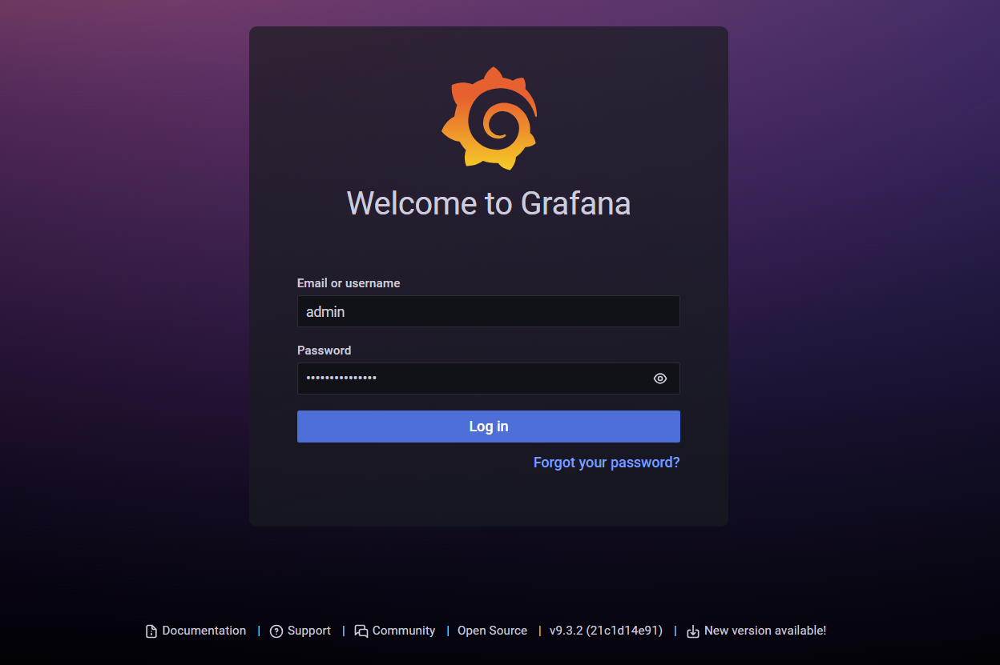
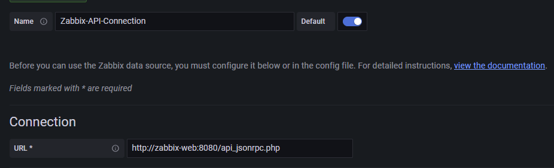
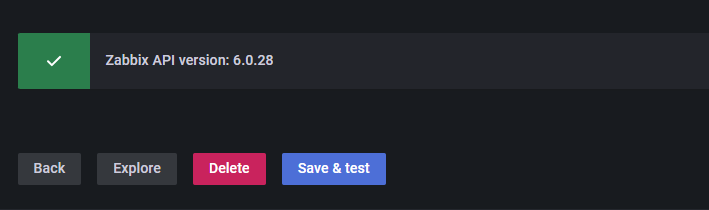
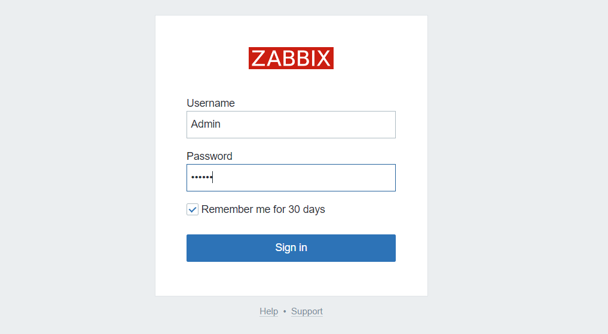

# Zabbix / Grafana Docker Appliance

<p align="center">
  
</p>

Prerequisites
Before you begin, ensure you have the following packages installed on your system:

- Git version 2.34.1
- Docker version 24.0.6, build ed223bc
- Docker Compose version v2.21.0

---
### Getting Started:

First, copy the line below and paste on your prompt to clone the repository:

```
git clone https://github.com/arthurcadore/zbx-grafana-appliance
```
If you don't have installed the package Git yet, do it before try to clone the respository!

Navigate to the project directory:

```
cd ./zbx-grafana-appliance
```

If you don't have Docker (and Docker-compose) installed on your system yet, it can be installed by run the following commands (Script for Ubuntu 22.04): 

```
./docker/installDocker.sh
```

**If you had to install docker, please remember to reboot you machine to grant user privileges for docker application.** 

In sequence, configure the environment variables for the application container, you can do this by edditing the files in the `.env_vars`: 

```
.POSTGRES_USER -> Change database User
.POSTGRES_PASSWORD -> Change database Password
.env_grafana -> Change Grafana Default 'Admin' password
```

### Start Application's Container: 
Run the command below to start docker-compose file: 

```
docker compose up & 
```

The "&" character creates a process id for the command inputed in, with means that the container will not stop when you close the terminal. 

---

### Access Application:

Once the container is up and running, you can access the applications web interface at the following addresses: 

- Zabbix Web Interface: 

```
http://localhost:8080/index.php
```

- Zabbix Server/Agent Interfaces: 

```
localhost:10050
localhost:10051
```

- Grafana: 

```
http://localhost:3000/login
```

- Database: 

```
pgsql://localhost:5432
```

--- 

### Configuring Grafana Dashboard: 

- First, access the Grafana web interface at `3000/TCP` port:



The default user is "admin", the password was configured in `.env_grafana` file. 

- In the `plugin` section, enable the "Zabbix" plugin for use it. 

- In sequence, create a new `data-source` using "Zabbix Data Source", in the configuration of it, insert the Zabbix-Web container API access: 



On the "Zabbix Connection" parameters, input the user and password of zabbix interface access, which is the following as default: 

```
User: Admin
Password: zabbix
```

- Finally, use the `save and test` button to verify if the parameters configurated have allowed the Grafana to consult the Zabbix API, the zabbix will show the following log if the connection was successfully: 



--- 

### Accessing the Zabbix Interface: 

To access the Zabbix web interface, use the `8080/TCP` port, with the following credentials: 

```
User: Admin
Password: zabbix
```



--- 
### Stop Container: 
To stop the running container, use the following command:

```
docker-compose down
```

This command stops and removes the containers, networks, defined in the docker-compose.yml file.


## References: 

- [Docker Compose For Zabbix (mpolinowski)](https://github.com/mpolinowski/zabbix-server-compose)

- [Zabbix Docker Containers](https://hub.docker.com/u/zabbix)

- [Instalation for Containers](https://www.zabbix.com/documentation/current/en/manual/installation/containers)


