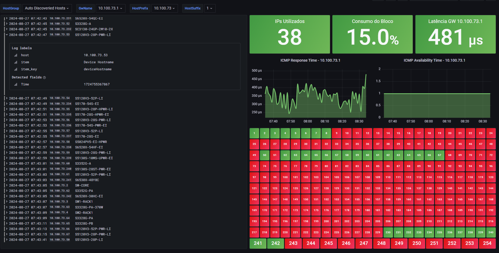

# Grafana Template for Monitoring a "/24" LAN (V2): 



# Configuration: 

## Create items on Zabix via API

- Change the `{$SNMP_COMMUNITY}` macro value in zabbix:

```
Administration -> General -> Macros: 

{$SNMP_COMMUNITY} = yourCommunityName
```

- Install Zabbix-API library for python:

```
pip install zabbix-api  
```

- Change the parameters of item's creation on script: 

```python
from zabbix_api import ZabbixAPI
 
zabbix_url = 'http://10.0.0.1:8080/api_jsonrpc.php'
zabbix_user = 'Admin'
zabbix_password = 'zabbix'

network_prefix = '10.100.73.'  
template_name = 'Intelbras Auto Discoveried Hosts'
group_name = 'Auto Discoveried Hosts'
```


- Execute the command using python3: 

```
python3 zbx-createitens.py
```