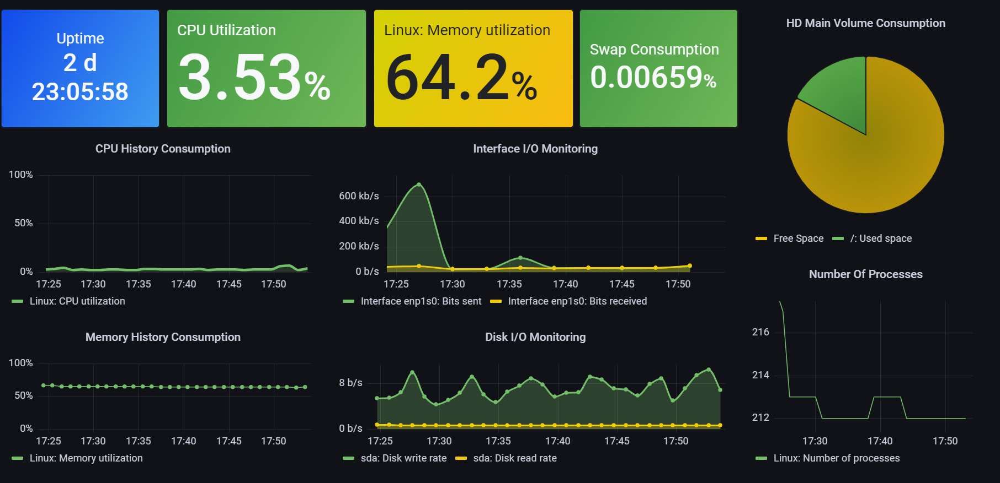

# Grafana Template for Zabbix Linux Server Agent monitoring: 



## To use it: 

On the server that will be monitorized, install zabbix-agent service: 

```
apt-get install zabbix-agent 
```

Configure zabbix agent parameters to allow connections from zabbix-server: 

```
vi /etc/zabbix/zabbix_agentd.conf
```

Just the follow options are needed, wich my zabbix-server IP address is `10.100.65.119` for example: 

```
### Option: ServerActive
#       List of comma delimited IP:port (or DNS name:port) pairs of Zabbix servers and Zabbix proxies for active checks.
#       If port is not specified, default port is used.
#       IPv6 addresses must be enclosed in square brackets if port for that host is specified.
#       If port is not specified, square brackets for IPv6 addresses are optional.
#       If this parameter is not specified, active checks are disabled.
#       Example: ServerActive=127.0.0.1:20051,zabbix.domain,[::1]:30051,::1,[12fc::1]
#
# Mandatory: no
# Default:
# ServerActive=

ServerActive=10.100.65.119

### Option: Server
#       List of comma delimited IP addresses, optionally in CIDR notation, or DNS names of Zabbix servers and Zabbix proxies.
#       Incoming connections will be accepted only from the hosts listed here.
#       If IPv6 support is enabled then '127.0.0.1', '::127.0.0.1', '::ffff:127.0.0.1' are treated equally
#       and '::/0' will allow any IPv4 or IPv6 address.
#       '0.0.0.0/0' can be used to allow any IPv4 address.
#       Example: Server=127.0.0.1,192.168.1.0/24,::1,2001:db8::/32,zabbix.example.com
#
# Mandatory: yes, if StartAgents is not explicitly set to 0
# Default:
# Server=

Server=10.100.65.119
```

Configure zabbix server to startup at linux OS boot: 

```
systemctl enable zabbix-agent.service
systemctl start zabbix-agent.service
```

